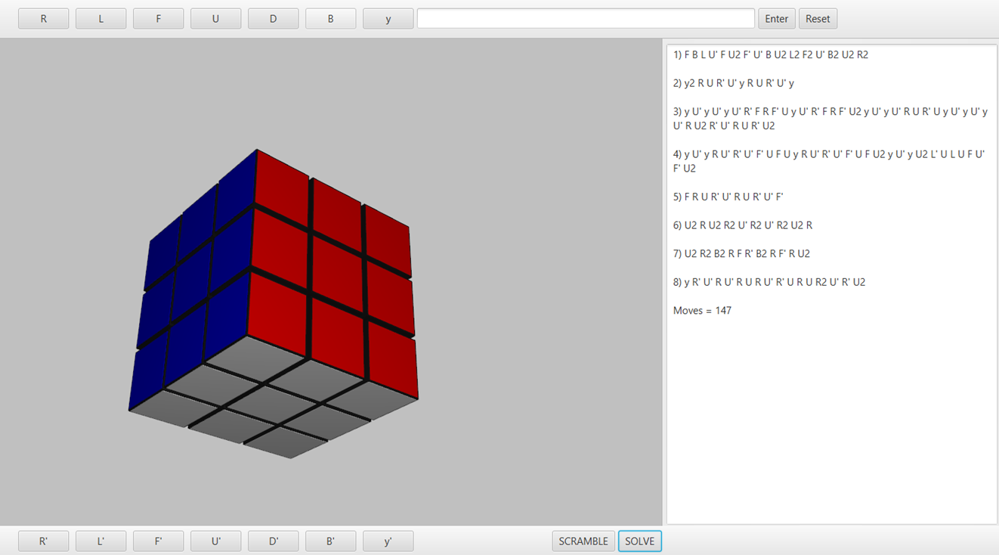

# Rubik's Cube Solver
Java program which can find a solution to a given or random scramble for a Rubik's Cube with 3D visualisation.

## Description
This program is able to find a solution to a scrambled Rubik's cube using beginner's, and some advanced methods. Average number of moves is 130-140.
When it can be optimized, program will do it. The goal of this project was to create a program which a beginner can use in order to learn how to solve the cube.
User can enter his own algorithm or generate random, then program will parse Cube and make optimized solution. After that process of solving can be visualised on 3D model.

This program is my final school project, so you can find my work and presentation in PROJECT folder of this repository.

## Usage
Before trying to use this program, I advise you to learn the standard notation for turns and rotations on a Rubik's cube
[here](https://speedcubing.ru/tutorial/3x3x3/beginner)

## JAR Files Execution
You can also find .jar files in PROJECT folder
* For laptop use: Rubiks Cube Laptop.jar
* For PC use: Rubiks Cube PC.jar
It depends on your resolution.

## Preview

 

